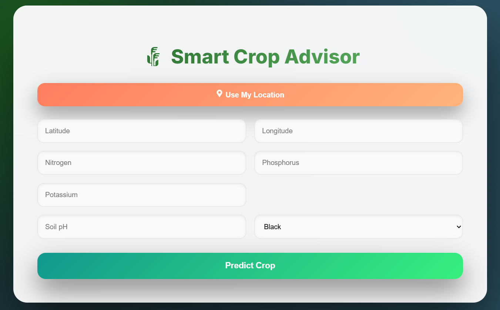
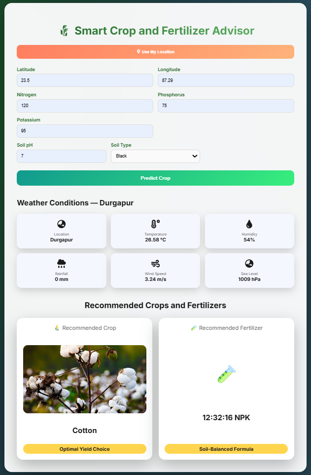

# 🌾 Smart Crop Recommendation System

An AI-powered web application that recommends the most suitable crop and fertilizer based on soil nutrients, environmental conditions, and geographic location. The system leverages Machine Learning and modern web technologies to assist farmers and agricultural planners in making data-driven decisions for improved productivity and sustainability.

---

## 🚀 Overview

Agricultural productivity depends heavily on selecting the right crop for specific soil and climate conditions. Traditional methods often rely on experience and may not account for dynamic environmental changes.

This project provides an intelligent solution that analyzes soil parameters, weather conditions, and location data to generate accurate crop and fertilizer recommendations through a user-friendly web interface.

---

## 🧠 Key Features

* 🌾 Predicts the most suitable crop for given conditions
* 🧪 Recommends an optimal fertilizer for soil health
* 📍 Supports automatic GPS-based location detection
* 🌦️ Displays environmental factors (temperature, humidity, rainfall)
* 🖥️ Modern, responsive dashboard interface
* 🖼️ Visual crop result with image display
* ⚡ Fast predictions using a trained ML model

---

## 📊 Input Parameters

The system accepts the following inputs:

### 🌍 Location

* Latitude
* Longitude (manual entry or automatic via geolocation)

### 🌱 Soil Nutrients

* Nitrogen (N)
* Phosphorus (P)
* Potassium (K)

### ⚗️ Soil Properties

* Soil pH
* Soil Color

### 🌦️ Environmental Data

* Temperature
* Humidity
* Rainfall

---

## 🎯 Output

The model predicts:

* 🌾 **Recommended Crop** — Best crop for optimal yield
* 🧪 **Recommended Fertilizer** — Balanced nutrient support

---

## 🏗️ System Architecture

### Frontend

* React (Vite)
* Modern responsive UI
* Interactive dashboard

### Backend

* Python (Flask / FastAPI)
* REST API for prediction requests

### Machine Learning

* Supervised learning model trained on agricultural datasets
* Data preprocessing and feature engineering applied

---

## 💻 Technology Stack

**Frontend**

* React.js
* Vite
* CSS

**Backend**

* Python
* Flask / FastAPI

**Machine Learning**

* Scikit-learn
* NumPy
* Pandas

---

## 🌍 Real-World Applications

* Farmer decision support systems
* Agricultural planning tools
* Smart farming platforms
* Government crop advisory systems
* Agri-tech startup solutions

---

## 🏆 Project Significance

This system promotes precision agriculture by enabling informed crop selection, reducing resource waste, and improving productivity. It demonstrates the integration of Machine Learning with full-stack web development to address real-world agricultural challenges.

---

## 🔮 Future Enhancements

* 🌐 Integration with live weather APIs
* 📈 Crop yield prediction
* 💰 Market price forecasting
* 📡 IoT-based soil moisture sensors
* 🗣️ Multilingual support for farmers
* 📱 Mobile application version

---

## 📂 Project Structure

```
frontend/
  public/
    images/
  src/
  index.html
  package.json

backend/
  model/
  app.py
```

---

## ⚙️ Installation & Setup

### 1️⃣ Clone the Repository

```
git clone <your-repo-link>
cd <repo-folder>
```

### 2️⃣ Run Frontend

```
cd frontend
npm install
npm run dev
```

### 3️⃣ Run Backend (Example for Flask)

```
cd backend
python app.py
```

---

## 📸 Screenshots

### 🖥️ Dashboard

<p align="center">
  
</p>

### 🌾 Prediction Result

<p align="center">
  
</p>

---

## 👨‍💻 Author

Developed as a Final Year Project in Artificial Intelligence and Web Development.

---

## 📜 License

This project is for educational purposes.
